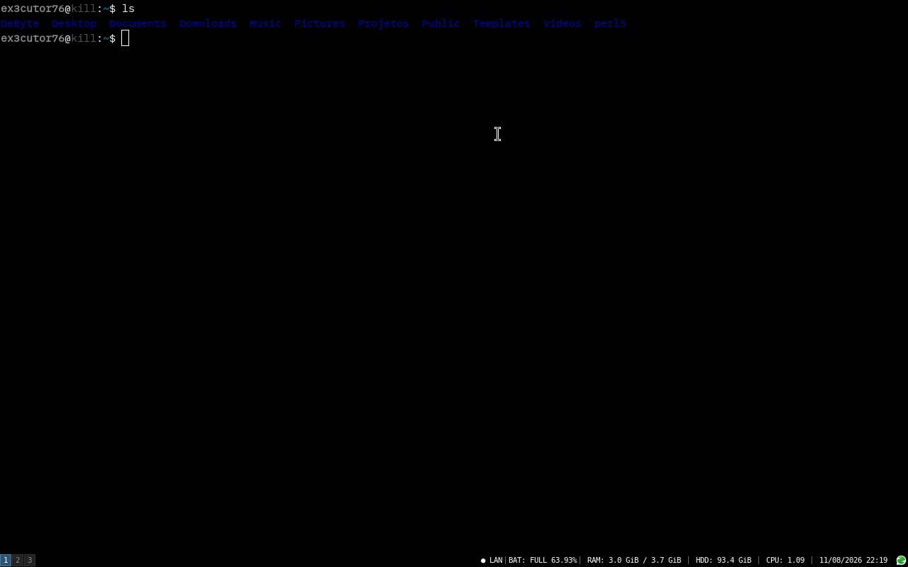
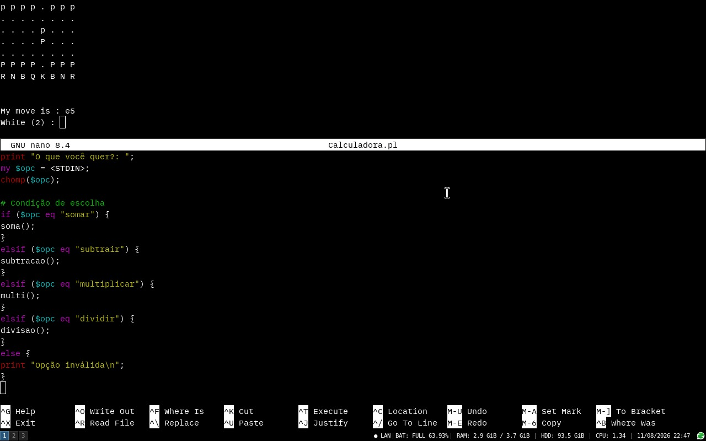
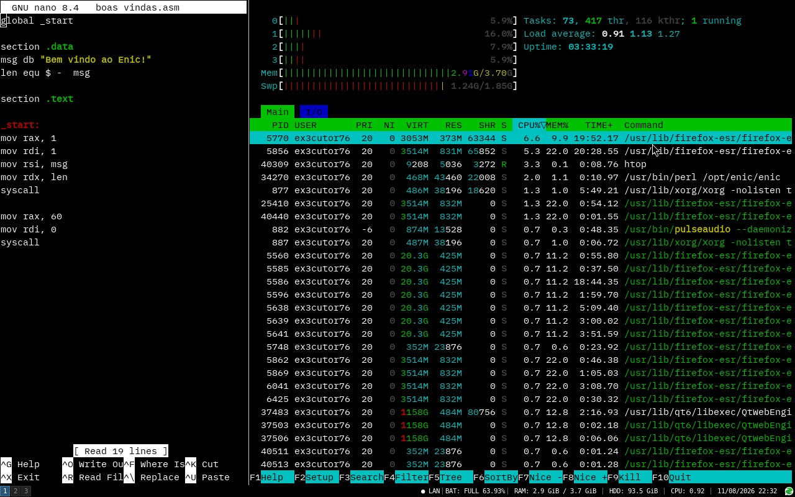

# O que é o ENIC?

ENIC é um emulador de terminal feito em perl, com objetivo de ser um emulador de terminal leve e com poucas dependências, utilizando o VTE/GTK3 para fornecer ao emulador a interface gráfica, enquanto seu shell tradicional é o bash.

## Por que o nome Enic?

O nome "Enic" é em homenagem ao Eniac, um dos primeiros computadores eletrônicos digitais de propósito geral da história da computação, com a imaginação de uma pergunta de "Como seria um terminal do Eniac se ele tivesse uma tela? E tivesse evoluído com o tempo?".

## Filosofia

Ser o mais leve possível e fácil de utilizar, mantendo apenas recursos necessários para uma experiência confortável de terminal.

## Recursos

- Emulação de terminal através de VTE 2.91;
- Interface GTK3;
- Shell bash;
- Scrollback;
- Cursor configurável;
- Fonte IBM Plex Mono 11;
- Copiar e colar;
- Menu de contexto;
- Selecionar tudo;
- Limpeza de terminal;
- Split vertical;
- Split horizontal;
- Integração com i3 e rofi;
- Arquivo .desktop;
- Instalação global através de `/usr/local/bin`;

## Requisitos

* Perl;
* GTK3;
* VTE 2.91;
* Pango;
* Bash;

**Aviso importante**: As dependências podem variar dependendo da distro Linux.

## Instalação

Clonar repositório: `git clone https://github.com/Ex3cutor76-V1/Enic.git`
Entrar no repositório: `cd Enic/`
Executar: `sudo ./install.sh`

**Aviso importante**: O arquivo `install.sh` na realidade não instala de fato o terminal, ele só organiza o ambiente para o Enic poder se adaptar melhor ao sistema para fácil acesso do usuário.

## Horizontal e Vertical

